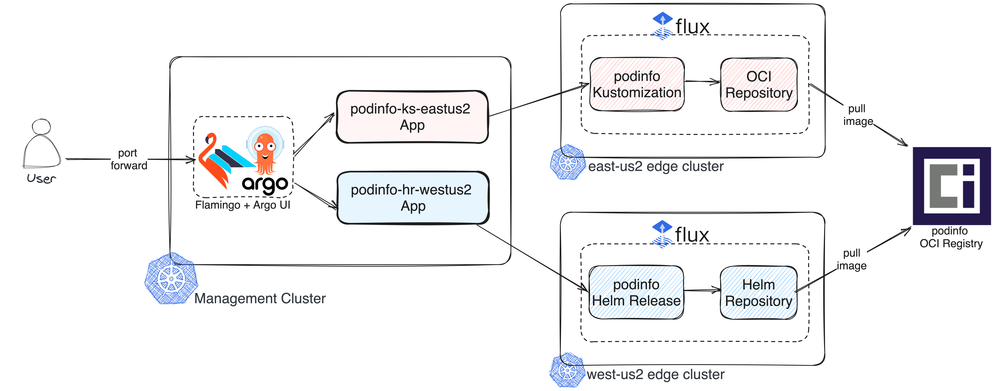

# Two GitOps Titans, One Powerful Solution: Flamingo (Flux + Argo)


- Session @ Open Source Summit NA 2024: [<https://sched.co/1aBNh>]([https://sched.co/1aBNh)

## Overview

The landscape of Kubernetes and containerized applications has evolved rapidly in recent years, demanding innovative solutions to manage and orchestrate deployments seamlessly. Flamingo, the Flux subsystem for ArgoCD, is a powerful integration of these two GitOps titans, to supercharge your workflows. This dynamic duo creates a seamless and powerful GitOps-driven platform for managing Kubernetes applications and infrastructure. Join us for a deep dive into Flamingo and discover how it can revolutionize your GitOps workflows. This lab will guide you step-by-step through the process of getting started with a Flamingo management cluster and two edge clusters to deploy and manage a sample application.

## Architectural Diagram



## Install Prerequisites

To get started with the lab, we need to meet some tool prerequisites. For our lab, we will be using Azure Kubernetes Service (AKS); however, you may also use a cloud provider of your choice. Simply replace the provided commands with the equivalent ones required to create a Kubernetes cluster and merge them into your existing kubeconfig.

```bash
# Install Azure CLI
brew install azure-cli

# Install Flux CLI 
brew install fluxcd/tap/flux

# Install Flamingo CLI
brew install flux-subsystem-argo/tap/flamingo
```

## Create the AKS management and edge clusters

```bash
# Set your Azure Subscription ID and required variables for cluster creation
export AZURE_SUBSCRIPTION_ID=$(az account show --query id -o tsv)
az account set --subscription $AZURE_SUBSCRIPTION_ID

export CLUSTER_RG=oss24
export MGMT_CLUSTER_NAME=flamingo-management
export LOCATION=southcentralus
export NODE_COUNT=2
export AZ_AKS_VERSION=1.27.9

# Create a resource group for the AKS clusters
az group create --name $CLUSTER_RG --location $LOCATION

# Create an AKS management cluster
az aks create -k $AZ_AKS_VERSION -y -g $CLUSTER_RG \
    -s Standard_B4ms -c $NODE_COUNT \
    --network-plugin kubenet -n $MGMT_CLUSTER_NAME

# Connect to the cluster and merge the kubeconfig
az aks get-credentials --resource-group $CLUSTER_RG --name $MGMT_CLUSTER_NAME --overwrite-existing

# Create edge clusters and merge them into the kubeconfig.
for LOCATION in eastus2 westus2; do \
  EDGE_CLUSTER_NAME="edge-dev-$LOCATION"; \
  az aks create -k $AZ_AKS_VERSION -y -g $CLUSTER_RG \
      -s Standard_B4ms -c $NODE_COUNT \
      --network-plugin kubenet -n $EDGE_CLUSTER_NAME \
      --location $LOCATION; \
  az aks get-credentials --resource-group $CLUSTER_RG --name $EDGE_CLUSTER_NAME --overwrite-existing
done
```

## Install Flamingo in the Management Cluster

```bash
# Switch Context to Management Cluster
kubectl config use-context $MGMT_CLUSTER_NAME

# Install Argo CD + Flamingo (You can also add the --export flag to generate the YAML files and manually apply them using kubectl apply)
flamingo install

# Verify the pods are running correctly
kubectl get pods -n argocd

# Obtain the initial password by running the following command to login. The default username is admin.
flamingo show-init-password

# Portforward to http://localhost:8080
flamingo port-fwd
```

> Access the Flamingo UI: [http://localhost:8080](http://localhost:8080).

## Install Flux Controllers in each edge cluster

```bash
export GITHUB_TOKEN=<update with your github PAT>

for LOCATION in eastus2 westus2; do \
  EDGE_CLUSTER_NAME="edge-dev-$LOCATION"; \
  kubectl config use-context "$EDGE_CLUSTER_NAME"; \
  flux bootstrap github --owner="joaquinrz" --repository="flamingo-oss24" --private=false --personal=true --path="clusters/$EDGE_CLUSTER_NAME"; \
done

git pull
```

## Deploy podinfo using Flux Kustomize controller in eastus2 edge cluster

We will now deploy the podinfo app in the eastus2 edge cluster using Kustomization. For more information about the Flux Kustomize controller, please refer to the documentation [here](https://fluxcd.io/flux/components/kustomize/).

```bash
kubectl config use-context "edge-dev-eastus2"
cat << EOF | kubectl apply -f -
---
apiVersion: v1
kind: Namespace
metadata:
  name: podinfo-kustomize
---
apiVersion: source.toolkit.fluxcd.io/v1beta2
kind: OCIRepository
metadata:
  name: podinfo
  namespace: podinfo-kustomize
spec:
  interval: 10m
  url: oci://ghcr.io/stefanprodan/manifests/podinfo
  ref:
    tag: 6.6.1
---
apiVersion: kustomize.toolkit.fluxcd.io/v1
kind: Kustomization
metadata:
  name: podinfo
  namespace: podinfo-kustomize
spec:
  interval: 10m
  targetNamespace: podinfo-kustomize
  prune: true
  sourceRef:
    kind: OCIRepository
    name: podinfo
  path: ./
EOF
```

## Deploy podinfo using Flux Helm controller in westus2 edge cluster

We will now deploy the podinfo app in the westus2 edge cluster using Helm. For more information about the Flux Helm controller, please refer to the documentation [here](https://fluxcd.io/flux/components/helm).

```bash
kubectl config use-context "edge-dev-westus2"
cat << EOF | kubectl apply -f -
---
apiVersion: v1
kind: Namespace
metadata:
  name: podinfo-helm
---
apiVersion: source.toolkit.fluxcd.io/v1beta2
kind: HelmRepository
metadata:
  name: podinfo
  namespace: podinfo-helm
spec:
  interval: 10m
  type: oci
  url: oci://ghcr.io/stefanprodan/charts
---
apiVersion: helm.toolkit.fluxcd.io/v2beta2
kind: HelmRelease
metadata:
  name: podinfo
  namespace: podinfo-helm
spec:
  interval: 10m
  targetNamespace: podinfo-helm
  chart:
    spec:
      chart: podinfo
      version: '6.6.1'
      sourceRef:
        kind: HelmRepository
        name: podinfo
      verify:
        provider: cosign # keyless
EOF
```

## Register Edge Clusters in Flamingo

To enable the management cluster to visualize and manage the resources of each edge cluster, we need to register each cluster by creating a secret based on the existing kubeconfig context.

```bash
kubectl config use-context $MGMT_CLUSTER_NAME

flamingo list-clusters

for LOCATION in eastus2 westus2; do \
  EDGE_CLUSTER_NAME="edge-dev-$LOCATION"; \
  flamingo add-cluster $EDGE_CLUSTER_NAME --insecure; \
done

flamingo list-clusters
```

## Register the Flux applications in Flamingo

```bash
kubectl config use-context $MGMT_CLUSTER_NAME
flamingo generate-app --app-name podinfo-ks-eastus2 edge-dev-eastus2/ks/podinfo -n podinfo-kustomize
flamingo generate-app --app-name podinfo-helm-westus2 edge-dev-westus2/hr/podinfo -n podinfo-helm

flamingo get -A
```

Now you can return to your Flamingo Dashboard [here](http://localhost:8080) to visualize and manage your Flux resources in each edge cluster!
